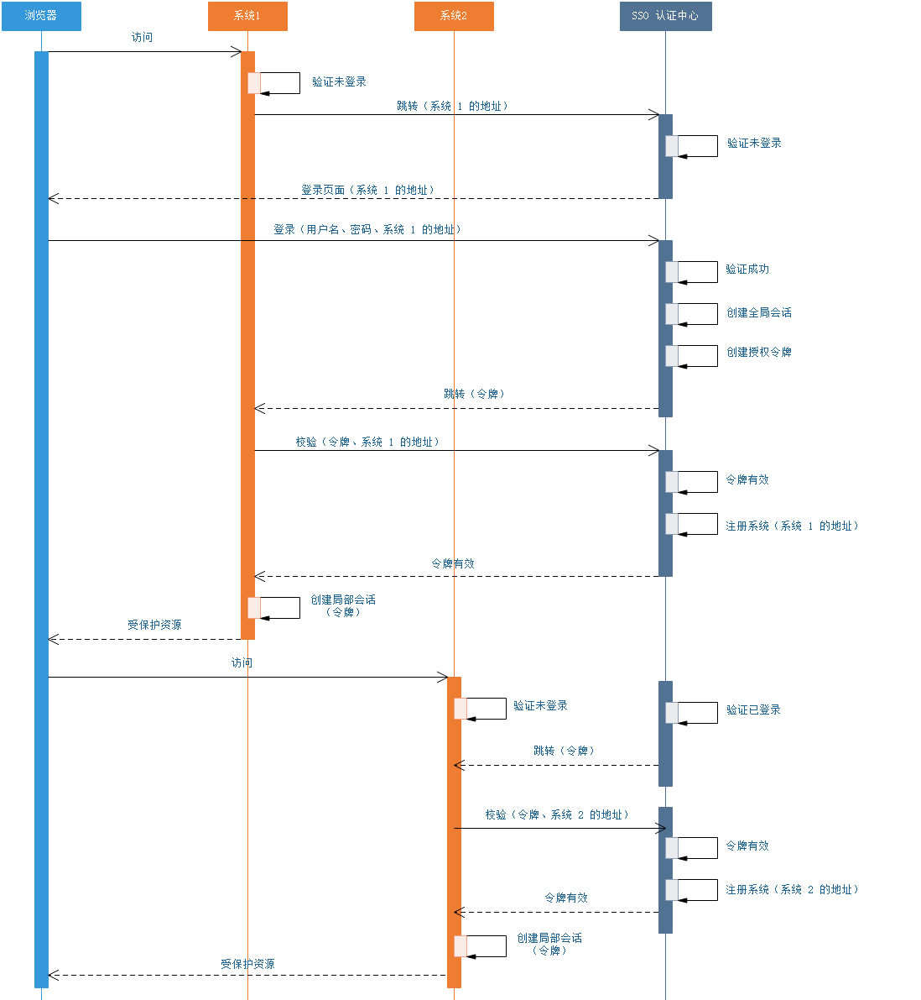

### 整体方案
1. 单点登录流程

2. 整合相关模块
    1. [Springboot 整合Redis](https://www.cnblogs.com/zeng1994/p/03303c805731afc9aa9c60dbbd32a323.html)
    2. [Springboot 整合tk-mybatis](https://www.funtl.com/zh/spring-boot-mybatis/Spring-Boot-%E6%95%B4%E5%90%88-tk-mybatis.html)
3. 核心设计思路
    1. 保证各个子系统都共享cookie，通过cookie来判断登录状态，有几种解决方案:
        1. 域名相同，端口不同可以共享cookie
        2. 多级域名的系统，可以在一级域名下共享cookie
        3. 域名不同的相关子系统可以使用Nginx做反向代理，使其在相同域名下
    2. 保存登录信息的地方必须能够被各个子系统访问到，项目中使用Redis
    3. sso登录中心需要正确完成重定向操作，包括:
        1. 登录: 用户从某个子系统发过来登录请求，完成登录后将其重定向回去
        2. 注销: 用户注销后，将用户重定向回登录中心，如果用户继续登录，应将其返回对应子系统首页

### 注意事项
1. sso-test 和 sso-core中都要用到共同的 User 类, 而sso-core在将其序列化到redis中使用了Jackson，携带了具体的包名，因此如果在sso-test中User的包名和sso-core不一致，将会导致反序列化错误。
在这个测试项目中，把User.java放到了统一的包下。在微服务开发模式下，可以将其做成公用的domain，供其他服务依赖。
2. sso-test的拦截器中需要获取到自身的url路径，在重定向到sso-core进行登录是需要携带，以便在完成登录后重定向回来
